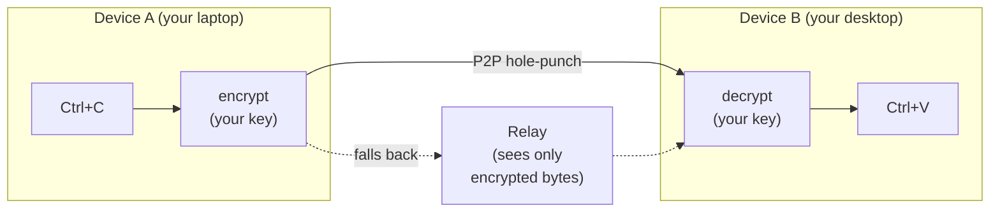

<div align="center">
  <h1>UniClipboard</h1>
  <a href="https://github.com/UniClipboard/UniClipboard/releases">
    
  </a>
  <a href="https://github.com/UniClipboard/UniClipboard/releases">
    
  </a >
  <a href="https://github.com/UniClipboard/UniClipboard/releases">
    
  </a>
  <a href="#mobile-companion-lan">
    
  </a>
  <a href="#mobile-companion-lan">
    
  </a>

  <div>
    <a href="./LICENSE">
      
    </a >
    <a href="https://github.com/UniClipboard/UniClipboard/releases">
      
    </a >
    <a href="https://codecov.io/gh/UniClipboard/UniClipboard" >
      
    </a>
  </div>

</div>

<p align="center">English | <a href="./README_ZH.md">简体中文</a></p>
<p align="center"><a href="./ABOUT.md">Who maintains this project? (About &amp; Trust)</a></p>

## Project Overview

> **Copy on one device. Paste on another — even across the internet.**
>
> No cloud account. No third-party servers. Your clipboard never leaves your devices in a form anyone else can read.

UniClipboard is a **privacy-first** clipboard tool.
It keeps a searchable, encrypted history of everything you copy, brings it back instantly through the Quick Panel, and syncs text, images, and files across your devices, whether they are on the same Wi-Fi or on different networks. Clipboard content is end-to-end encrypted in transit and stays encrypted at rest; it is decrypted only on your own devices, so relays and the network in between only ever see ciphertext.

<p align="center">
  
</p>

<p align="center">
  <video src="https://github.com/user-attachments/assets/367c7f45-579a-49b7-bc96-9ccc25cf5ad0" controls muted playsinline width="800"></video>
  <br/>
  <em>Desktop ↔ desktop — real-time, bidirectional clipboard sync between two computers.</em>
</p>

<details>
  <summary><strong>Mobile demo</strong> — share a screenshot from your phone to your desktop. (click to expand)</summary>
  <p align="center">
    <video src="https://github.com/user-attachments/assets/29f4bf5d-8996-4602-8784-067fb919c671" controls muted playsinline width="800"></video>
  </p>
</details>

> [!IMPORTANT]
> **Upgrading from 0.19.x?** 1.0 is a breaking upgrade: local data is converted to a new format (you cannot downgrade to 0.19 afterwards), and every device must run 1.0 and be paired again before syncing resumes. Read the [0.19 → 1.0 upgrade guide](https://docs.uniclipboard.app/migration/upgrade-0-19-to-v1) before upgrading.

## Table of Contents

- [Features](#features)
- [Installation](#installation)
  - [Download from Releases](#download-from-releases)
  - [One-line install script (Linux / macOS)](#one-line-install-script-linux--macos)
  - [Linux](#linux)
  - [Homebrew (macOS)](#homebrew-macos)
  - [Upgrading from 0.19.x](#upgrading-from-019x)
  - [Build from Source](#build-from-source)
- [Usage](#usage)
  - [First Device (Create a Space)](#first-device-create-a-space)
  - [Adding More Devices (Join via Invitation)](#adding-more-devices-join-via-invitation)
  - [Connect a Phone](#mobile-companion-lan)
  - [Main Pages](#main-pages)
- [Advanced Features](#advanced-features)
  - [How it Works](#how-it-works)
  - [Command-line Tool](#command-line-tool)
  - [Privacy & Security](#privacy--security)
- [FAQ](#faq)
- [Contributing](#contributing)
- [License](#license)
- [Acknowledgments](#acknowledgments)
- [Community](#community)

## Features

- **Desktop apps for Windows, macOS, and Linux**: Native installers for x86_64 and ARM64 (Apple Silicon / Intel on macOS), plus a standalone `uniclip` CLI.
- **Local full-text search**: Search your whole history quickly with suggestions and keyboard completion — the search index itself stays encrypted on disk.
- **Quick Panel**: A keyboard-shortcut overlay with inline previews for text, links, images, code, and files. On Linux desktops without global shortcuts, it can be opened from a desktop shortcut instead.
- **Cross-network sync**: Desktop devices sync directly on the same network or across the internet with automatic NAT traversal, falling back to an encrypted relay when no direct path exists. You can also add your own relay servers.
- **Encrypted spaces**: Devices join a shared "space" with a short-lived invitation code plus the space passphrase — no cloud account, no email.
- **Text, images, and files**: Copy on one device, paste on another. Large files are streamed, incoming transfers continue after an app restart, and multi-item transfers show combined progress and can be cancelled.
- **Per-device sync control**: Choose which content types each paired device sends and receives, pause all sync or automatic sync separately (manual sending still works), and toggle sync per device from the tray menu. A device that comes back online receives the latest item it missed.
- **Command-line tool**: `uniclip` covers setup, pairing, sending, receiving, and member management headlessly — built for terminals, SSH sessions, scripts, and servers.
- **Multi-device management**: See each device's connection state, adjust per-device sync preferences, and remove a lost device from any other paired one.
- **Safe upgrades and recovery**: Local data is backed up automatically before upgrades. If the system-stored key is lost, you can recover with the original space passphrase.
- **Mobile apps**: The [UniClipboard mobile app](https://github.com/UniClipboard/UniClip) for iOS and Android connects to your desktop — see [Connect a Phone](#mobile-companion-lan).
- **Localized UI**: English, Simplified Chinese, Traditional Chinese, Japanese, Russian, and Brazilian Portuguese.

## Installation

### Download from Releases

Download the latest version from [GitHub Releases](https://github.com/UniClipboard/UniClipboard/releases/latest):

| Platform | Packages |
| --- | --- |
| macOS | `.dmg` for Apple Silicon and Intel |
| Windows | Installer (`-setup.exe`) and portable `.zip`, for x86_64 and ARM64 |
| Linux | `.deb`, `.rpm`, and `.AppImage`, for x86_64 and aarch64 |
| CLI only | `uniclipboard-cli-*` archives for macOS, Linux (musl), and Windows x86_64 |

Every release ships `.sig` signature files and a signed `SHA256SUMS.txt` for verification.

### One-line install script (Linux / macOS)

Don't want to pick a package by hand? One command does it:

```bash
curl -fsSL https://uniclipboard.app/install.sh | bash
```

The script installs the latest stable release and detects OS and CPU automatically:

- **macOS** — downloads `.app.tar.gz`, extracts it, and moves `UniClipboard.app` into `/Applications` (escalates with `sudo` if the directory isn't writable; pass `--prefix "$HOME/Applications"` for a user-level install).
- **Linux** — with sudo, installs the `.deb` on apt-based systems or uses the COPR repository on dnf-based systems (Ubuntu 20.04 uses the Snap package); otherwise falls back to AppImage in `~/.local/bin` with a `.desktop` entry (no root needed).

Common flags:

```bash
# Pin a specific version
curl -fsSL https://uniclipboard.app/install.sh | bash -s -- --version v1.0.1

# Force AppImage (rootless even when sudo is available)
curl -fsSL https://uniclipboard.app/install.sh | bash -s -- --format appimage
```

Uninstall with the matching script:

```bash
# Remove the app only, keep data and config
curl -fsSL https://raw.githubusercontent.com/UniClipboard/UniClipboard/main/scripts/uninstall.sh | bash

# Full wipe — also removes data directories, config, and cache
curl -fsSL https://raw.githubusercontent.com/UniClipboard/UniClipboard/main/scripts/uninstall.sh | bash -s -- --purge

# Preview what would be removed without deleting anything
curl -fsSL https://raw.githubusercontent.com/UniClipboard/UniClipboard/main/scripts/uninstall.sh | bash -s -- --dry-run
```

> Update behavior matches the manual download paths below: `.deb` / `.rpm` / COPR / Snap installs are updated by your system package manager, not the in-app updater. AppImage on Linux and `.app` on macOS update from inside the app.

### Linux

Each release ships `.deb`, `.rpm`, and `.AppImage` artifacts for both `x86_64` and `aarch64`.

**Fedora / RHEL / openSUSE — via COPR (recommended, auto-updating)**

```bash
sudo dnf copr enable mkdir700/uniclipboard         # stable; mkdir700/uniclipboard-alpha for pre-releases
sudo dnf install uniclipboard
```

After enabling, `sudo dnf upgrade` will pick up new releases automatically.

**Snap**

```bash
sudo snap install uniclipboard
```

**Or download a single .rpm / .deb / AppImage from the Releases page:**

```bash
# Debian / Ubuntu
sudo dpkg -i UniClipboard_<version>_amd64.deb
sudo apt-get install -f                                 # resolve missing deps if any

# Fedora / RHEL / openSUSE (one-shot, no COPR)
sudo dnf install ./UniClipboard-<version>-1.x86_64.rpm

# AppImage (any distro)
chmod +x UniClipboard_<version>_amd64.AppImage
./UniClipboard_<version>_amd64.AppImage
```

> Packaged installs (COPR / Snap / rpm / deb) do not auto-update from inside the app — use your package manager. The AppImage is what the in-app updater uses on Linux.

### Homebrew (macOS)

On macOS, install via the official tap [`UniClipboard/homebrew-tap`](https://github.com/UniClipboard/homebrew-tap):

```bash
brew tap UniClipboard/tap

# Homebrew 6.0+ requires you to trust third-party taps before it will load
# their formulae/casks. Skip this and you'll hit
# "Refusing to load ... from untrusted tap". It only needs to run once.
brew trust UniClipboard/tap

# Desktop app (.app bundle)
brew install --cask uniclipboard

# CLI only — installs the `uniclip` command
brew install uniclipboard
```

Or install in a single command without tapping first (still trust the tap once):

```bash
brew trust UniClipboard/tap                          # Homebrew 6.0+, one-time
brew install --cask UniClipboard/tap/uniclipboard    # GUI
brew install UniClipboard/tap/uniclipboard           # CLI
```

The cask and the formula can coexist — install both if you want the GUI plus the `uniclip` command.

### Upgrading from 0.19.x

1.0 converts local data to a new storage and protection format and uses a new pairing scheme:

- Upgrade in place with the same installation style; history is backed up automatically on first launch, which takes longer than usual.
- You cannot downgrade to 0.19 afterwards, and 0.19 and 1.0 devices cannot sync with each other.
- After upgrading, old pairings are cleared. Once every device runs 1.0, pair them again from the **Devices** page.

Follow the [0.19 → 1.0 upgrade guide](https://docs.uniclipboard.app/migration/upgrade-0-19-to-v1) for the recommended order, backup locations, and recovery steps.

### Build from Source

Prerequisites: the Rust toolchain (pinned by `rust-toolchain.toml`), [Bun](https://bun.sh), [Go](https://go.dev) (version in `apps/gui-go/go.mod`), and the [Wails v3 prerequisites](https://v3alpha.wails.io/getting-started/installation/) for your OS. The Go GUI currently runs on macOS only from source.

```bash
git clone https://github.com/UniClipboard/UniClipboard.git
cd UniClipboard

# Install dependencies
bun install

# Start development mode (isolated `dev` profile, so it doesn't touch an installed app's data)
bun wails:dev

# Build a local macOS app bundle
apps/gui-go/build.sh
```

The bundle layout is described in `apps/gui-go/README.md`. See [CONTRIBUTING.md](./CONTRIBUTING.md) for multi-peer development, tests, and project conventions.

## Usage

### First Device (Create a Space)

1. Launch the app, choose **This is my first device**, and click **Start new space**.
2. Set an encryption passphrase — it protects all data in the space and is needed to add devices, so keep it safe.
3. Done. Copied content is stored encrypted in this space.

### Adding More Devices (Join via Invitation)

1. On an existing device, open the **Devices** page and click **Invite Device** to generate a short-lived invitation code.
2. On the new device, choose **I already use UniClipboard elsewhere** → **Join via pairing**, then enter the invitation code together with the space passphrase.
3. Once the pairing is confirmed, the device joins and syncing starts automatically.

> Already set up and want to move to another space? Use **Join another space** on the Devices page (or run `uniclip space join --switch` from the CLI); your local clipboard history is migrated to the new space. Without `--switch`, `uniclip space join` takes the non-destructive re-pair path and does not switch spaces.

### Connect a Phone <a id="mobile-companion-lan"></a>

The **[UniClipboard mobile app](https://github.com/UniClipboard/UniClip)** covers **iOS** ([TestFlight public beta](https://testflight.apple.com/join/nyNQ8dQe)) and **Android** ([APK downloads](https://github.com/UniClipboard/UniClip/releases/latest)). On the desktop, open **Devices** and click the phone icon to open **Connect phone**, which offers two methods:

- **Regular sync** (default) — an HTTP compatibility mode. The desktop daemon runs a small SyncClipboard-compatible HTTP service; the dialog registers the phone and shows a QR code with the address and one-time credentials for the app to scan.
- **Device connection (Experimental)** — the phone joins your encrypted space with an invitation code, like another desktop.

Regular sync limitations:

- **Not P2P** — the phone is a plain HTTP client with no NAT traversal or relay. It works on the local network; for other networks, use a [headless server node](https://docs.uniclipboard.app/guides/self-host-server-node) (public HTTPS) or a Tailscale / VPN overlay.
- **Plain HTTP + Basic Auth at the listener** — only enable it on networks you trust, or put it behind a TLS reverse proxy.
- **The phone is not a space member** — it gets no node ID and cannot read the encrypted history database.
- **No silent background sync on iOS** — iOS doesn't give apps a general-purpose background clipboard hook, so the iOS app syncs while in the foreground or through its keyboard and share extensions. See [FAQ — iOS background sync](https://docs.uniclipboard.app/help/faq#why-cant-the-ios-app-sync-clipboard-silently-in-the-background-like-the-desktop).

> ⚠️ If TestFlight shows a certificate error or the **Install** button keeps spinning, temporarily disable your proxy / VPN client (including global rules, TUN, HTTPS decryption / MitM) so TestFlight connects directly, then re-enable it after installing.

See the [mobile app guide](https://docs.uniclipboard.app/mobile) and the [desktop mobile sync guide](https://docs.uniclipboard.app/core-features/mobile-sync) for the full setup flow.

### Main Pages

- **History** — Clipboard history with full-text search, filters, and detailed previews
- **Quick Panel** — Keyboard-shortcut overlay for fast clipboard access
- **Devices** — Invite devices, connect phones, view connection state, manage per-device sync, and switch or rebuild spaces
- **Settings** — General, appearance, shortcuts, Quick Panel, sync, security, network, storage (including upgrade backups), and about

## Advanced Features

### How it Works



- **Pairing**: A new device joins with a one-time invitation code and the space passphrase — no cloud account, no email.
- **Transport**: Direct connection when devices can reach each other (same network, or NAT hole-punching across networks); an encrypted relay is used otherwise.
- **Encryption**: Payload encryption is independent of the transport — even a malicious relay only sees ciphertext.
- **Storage**: Local history, previews, and the search index are encrypted at rest.
- **Resilience**: Connections recover automatically after network changes, sleep/wake, or brief disconnects, and you can refresh a device's connection from the Devices page.

**Components.** The desktop app has three parts: the GUI (Tauri + React), the background daemon `uniclipd` that syncs and stores your clipboard, and the `uniclip` CLI. The GUI and CLI talk to the same local daemon over a loopback HTTP / WebSocket API, so they always show the same state. Sync, encryption, and storage are implemented in the separate [UniClipboard Engine](https://github.com/UniClipboard/Engine) repository, which this repository pins to a fixed revision in `Cargo.toml`.

### Command-line Tool

The `uniclip` CLI works with or without the GUI (e.g. on servers). Common commands:

```bash
uniclip space init                          # Create a new encrypted space on this device
uniclip space invite                        # Generate a short-lived invitation code
uniclip space change-passphrase             # Change the space passphrase (unlocked, single-device space)
uniclip space join --code <code>            # Join a space (re-pair, non-destructive)
uniclip space join --switch --code <code>   # Switch to another space
uniclip space status                        # Inspect the active space and daemon
uniclip member list                         # List paired devices and presence
uniclip send "hello"                        # Send text to other devices
uniclip send ./report.pdf                   # Send an existing file
printf '%s\n' ./a.png './b c.pdf' | uniclip send --file   # Send paths from stdin
uniclip send --text report.pdf              # Force an existing filename to be sent as text
uniclip get                                 # Fetch the latest entry
uniclip get --wait                          # Wait for the next synced entry
uniclip get --copy                          # Copy the latest entry to this computer's clipboard
uniclip search "invoice"                    # Search clipboard history
uniclip start / stop                        # Daemon lifecycle
```

Run `uniclip --help` for the full list, or see the [CLI reference](https://docs.uniclipboard.app/cli/reference).

### Privacy & Security

**What we collect** — Two separate, anonymous channels: diagnostics (crashes, errors, and redacted logs) and usage analytics (product events such as setup and sync outcomes). They never include clipboard content, file names or paths, passphrases or keys, or search queries. Both are on by default; the first-start notice lets you turn both off, and you can control each one under **Settings → General → Privacy**. See [Privacy & data collection](https://docs.uniclipboard.app/core-features/privacy) for the exact fields.

**What a relay can see** — Encrypted bytes and connection metadata (source / destination peer IDs). It can't decrypt your content.

**What's stored on disk** — An encrypted SQLite database and an encrypted search index; clipboard text, titles, previews, tags, and file names are encrypted before they are written.

**If you lose a device** — Remove it from any other paired device. Other devices stop sending it new content.

**You can audit it** — The desktop app and the [Engine](https://github.com/UniClipboard/Engine), including the cryptography, are open source on GitHub.

#### Cryptography details

- **XChaCha20-Poly1305 AEAD** for clipboard content, with a 24-byte random nonce and 256-bit keys; it provides confidentiality plus integrity and authenticity checks.
- **Argon2id** derives key-encryption material from your space passphrase (default: 128 MiB memory, 3 iterations, 4 lanes), resisting GPU / ASIC cracking.
- **Layered keys**: content keys live in an encrypted per-profile key vault. The system secure storage (macOS Keychain, Windows Credential Manager, Linux Secret Service) keeps only the material that unlocks it automatically; if that material is lost, the original space passphrase can restore access.
- **Per-space isolation**: Each space has its own keys.

## FAQ

<details>
  <summary><strong>Why not just use iCloud Universal Clipboard?</strong></summary>

If you only use Apple devices, don't need history, and fully trust Apple's closed-source end-to-end encryption — iCloud is fine. The moment you add a Windows or Linux machine, want a searchable history, or want to verify the encryption yourself, you need something else.
</details>

<details>
  <summary><strong>Why not a self-hosted clipboard sync (e.g. ClipCascade)?</strong></summary>

Self-hosted means you have to run a server. UniClipboard works out of the box — direct P2P first, encrypted relay only as a fallback. You never have to operate any infrastructure.
</details>

<details>
  <summary><strong>Does it work on a LAN without the relay?</strong></summary>

Devices that can reach each other on the same network connect directly without going through the relay. **Settings → Network → LAN-only Mode** turns off relay fallback entirely; with it on, devices on different networks cannot reach each other. See the [FAQ](https://docs.uniclipboard.app/help/faq) for what still reaches the internet in this mode.
</details>

<details>
  <summary><strong>Where does my clipboard history actually live?</strong></summary>

Only on your devices, encrypted at rest. No UniClipboard server ever receives or stores your clipboard content.
</details>

<details>
  <summary><strong>Is there a mobile app?</strong></summary>

Yes — the **[UniClipboard mobile app](https://github.com/UniClipboard/UniClip)** covers both iOS and Android. It connects through Regular sync by default, with an experimental Device connection mode that joins your space by invitation code. See [Connect a Phone](#mobile-companion-lan).
</details>

<details>
  <summary><strong>I upgraded from 0.19 and my devices no longer sync. What happened?</strong></summary>

This is expected: 1.0 uses a new pairing scheme, so old pairings are cleared and a 0.19 device cannot pair with a 1.0 device. Upgrade every device to 1.0, then pair them again. See the [upgrade guide](https://docs.uniclipboard.app/migration/upgrade-0-19-to-v1).
</details>

## Contributing

Contributions of all kinds are welcome! Please read [CONTRIBUTING.md](./CONTRIBUTING.md) for the full development setup, branching strategy, commit conventions, and PR process.

Quick start:

1. Fork this repository
2. Create your feature branch (`git checkout -b feature/amazing-feature`)
3. Commit your changes following the project's [commit conventions](./CONTRIBUTING.md#commit-conventions)
4. Push to the branch (`git push origin feature/amazing-feature`)
5. Open a Pull Request against the `main` branch

## License

This project is licensed under the AGPL-3.0 License - see the [LICENSE](./LICENSE) file for details.

## Acknowledgments

- [Wails](https://wails.io) - Cross-platform application framework
- [React](https://react.dev) - Frontend UI development framework
- [Rust](https://www.rust-lang.org) - Safe and efficient backend implementation language
- [iroh](https://www.iroh.computer) - QUIC-based P2P networking that powers cross-network direct connections and blob transfer
- [Tokio](https://tokio.rs) - Asynchronous runtime that drives every networking and I/O path
- [shadcn/ui](https://ui.shadcn.com) - Composable component recipes built on Radix UI
- [Radix UI](https://www.radix-ui.com) - Unstyled, accessible primitives behind the desktop interface
- [Tailwind CSS](https://tailwindcss.com) - Utility-first styling for the entire UI
- [SQLite](https://www.sqlite.org) - Embedded database that stores clipboard history locally

## Community

Join us to chat with other users and the dev team:

<table align="center">
  <tr>
    <td align="center"><strong>QQ Group</strong></td>
    <td align="center"><strong>WeChat Group</strong></td>
    <td align="center"><strong>Telegram Group</strong></td>
  </tr>
  <tr>
    <td align="center"></td>
    <td align="center"></td>
    <td align="center"><a href="https://t.me/uniclipboard"></a></td>
  </tr>
</table>

---

**Have questions or suggestions?** [Create an Issue](https://github.com/UniClipboard/UniClipboard/issues/new) or contact us to discuss!
