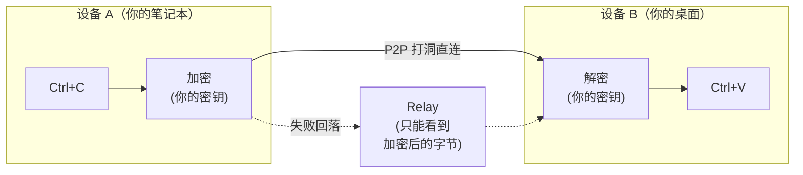
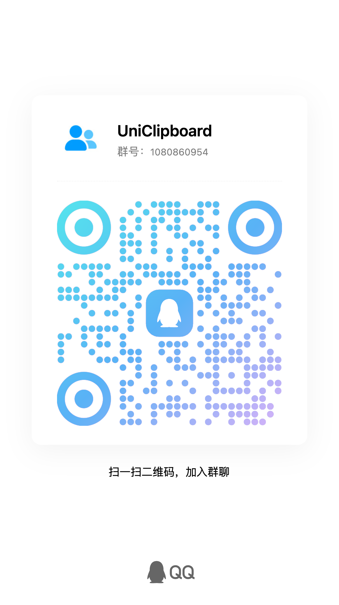
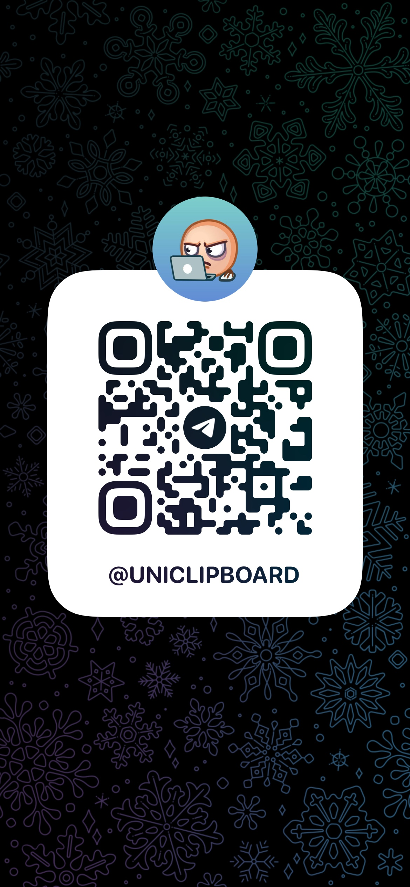

<div align="center">

  <a href="https://github.com/UniClipboard/UniClipboard/releases">
    
  </a>
  <a href="https://github.com/UniClipboard/UniClipboard/releases">
    
  </a>
  <a href="https://github.com/UniClipboard/UniClipboard/releases">
    
  </a>
  <a href="#mobile-companion-lan">
    
  </a>
  <a href="#mobile-companion-lan">
    
  </a>

  <div>
    <a href="./LICENSE">
      
    </a>
    <a href="https://github.com/UniClipboard/UniClipboard/releases">
      
    </a>
    <a href="https://codecov.io/gh/UniClipboard/UniClipboard" >
      
    </a>
  </div>

</div>

<p align="center"><a href="./README.md">English</a> | 简体中文</p>
<p align="center"><a href="./ABOUT_ZH.md">谁在维护这个项目？（关于本项目 & 信任说明）</a></p>

## 项目介绍

> **一台设备 Ctrl+C，另一台设备 Ctrl+V —— 哪怕跨着一整个互联网。**
>
> 无需云账号，无需第三方服务器。你的剪贴板从未以任何人能读懂的形式离开过你的设备。

UniClipboard 是一款以 **隐私优先** 为核心理念的剪贴板工具。它为你复制过的内容保留可搜索的加密历史，通过快捷面板随时取用，并在你的设备之间同步文本、图片和文件，无论设备处于同一 Wi-Fi 还是不同网络。剪贴板内容在传输过程中端到端加密，本地存储时同样保持加密，只在你自己的设备上解密；中继与中间网络只能看到密文。

<p align="center">
  
</p>

<p align="center">
  <video src="https://github.com/user-attachments/assets/367c7f45-579a-49b7-bc96-9ccc25cf5ad0" controls muted playsinline width="800"></video>
  <br/>
  <em>桌面端 ↔ 桌面端：两台电脑之间实时双向同步剪贴板。</em>
</p>

<details>
  <summary><strong>移动端演示</strong> —— 在手机上分享截图到电脑。（点击展开）</summary>
  <p align="center">
    <video src="https://github.com/user-attachments/assets/29f4bf5d-8996-4602-8784-067fb919c671" controls muted playsinline width="800"></video>
  </p>
</details>

> [!IMPORTANT]
> **从 0.19.x 升级？** 1.0 是不兼容升级：本地数据会转换为新格式（升级后无法降级回 0.19），所有设备都必须升级到 1.0 并重新配对后才能继续同步。升级前请先阅读 [0.19 → 1.0 升级指南](https://docs.uniclipboard.app/zh/migration/upgrade-0-19-to-v1)。

## 目录

- [功能特点](#功能特点)
- [安装方法](#安装方法)
  - [从 Releases 下载](#从-releases-下载)
  - [一键安装脚本（Linux / macOS）](#一键安装脚本linux--macos)
  - [Linux](#linux)
  - [Homebrew（macOS）](#homebrewmacos)
  - [从 0.19.x 升级](#从-019x-升级)
  - [从源码构建](#从源码构建)
- [使用说明](#使用说明)
  - [第一台设备（新建空间）](#第一台设备新建空间)
  - [添加更多设备（通过邀请码加入）](#添加更多设备通过邀请码加入)
  - [连接手机](#mobile-companion-lan)
  - [主要页面](#主要页面)
- [高级功能](#高级功能)
  - [工作原理](#工作原理)
  - [命令行工具](#命令行工具)
  - [隐私与安全](#隐私与安全)
- [常见问题](#常见问题)
- [参与贡献](#参与贡献)
- [许可证](#许可证)
- [鸣谢](#鸣谢)
- [交流群](#交流群)

## 功能特点

- **Windows、macOS、Linux 桌面应用**：提供 x86_64 与 ARM64 安装包（macOS 区分 Apple Silicon 与 Intel），另有独立的 `uniclip` 命令行工具。
- **本地全文搜索**：快速搜索全部历史，支持搜索建议与键盘补全；搜索索引本身在磁盘上同样加密。
- **快捷面板**：通过键盘快捷键唤出，内嵌文本、链接、图片、代码与文件预览。在不支持全局快捷键的 Linux 桌面上，可以改用桌面快捷方式打开。
- **跨网络同步**：桌面设备在同一网络内直连，跨互联网时自动 NAT 穿透；没有直连路径时回落到加密中继。也可以添加自建中继服务器。
- **加密空间**：设备通过短期有效的邀请码 + 空间口令加入同一个"空间" —— 不需要云账号，也不需要邮箱。
- **文本、图片、文件**：在一台设备复制，在另一台设备粘贴。大文件流式传输；接收中的传输在应用重启后继续，多项传输显示合并进度并可取消。
- **按设备控制同步**：为每台已配对设备选择收发哪些内容类型；可以分别暂停全部同步或自动同步（手动发送仍可用），也可以在托盘菜单里按设备开关同步。设备重新上线后会自动收到错过的最新一条内容。
- **命令行工具**：`uniclip` 可以在无界面环境下完成创建空间、配对、发送、接收与成员管理 —— 适合终端、SSH、脚本与服务器。
- **多设备管理**：查看每台设备的连接状态，调整按设备的同步偏好；设备丢失时，可在任意一台已配对设备上将其移除。
- **安全升级与恢复**：升级前自动备份本地数据；系统中保存的密钥丢失时，可以用原空间口令恢复。
- **移动端 App**：[UniClipboard 移动端 App](https://github.com/UniClipboard/UniClip) 覆盖 iOS 与 Android，可连接你的电脑 —— 见 [连接手机](#mobile-companion-lan)。
- **多语言界面**：英语、简体中文、繁体中文、日语、俄语、巴西葡萄牙语。

## 安装方法

### 从 Releases 下载

从 [GitHub Releases](https://github.com/UniClipboard/UniClipboard/releases/latest) 下载最新版本：

| 平台 | 安装包 |
| --- | --- |
| macOS | `.dmg`，分 Apple Silicon 与 Intel |
| Windows | 安装程序（`-setup.exe`）与便携版 `.zip`，分 x86_64 与 ARM64 |
| Linux | `.deb`、`.rpm`、`.AppImage`，分 x86_64 与 aarch64 |
| 仅 CLI | `uniclipboard-cli-*` 压缩包，覆盖 macOS、Linux（musl）与 Windows x86_64 |

每次发布都附带 `.sig` 签名文件和带签名的 `SHA256SUMS.txt`，可用于校验。

### 一键安装脚本（Linux / macOS）

不想手动挑包？一行命令搞定：

```bash
curl -fsSL https://uniclipboard.app/install.sh | bash
```

脚本默认安装最新正式版，并自动识别系统与架构：

- **macOS** —— 下载 `.app.tar.gz`，解压后搬到 `/Applications/UniClipboard.app`（写权限不足时自动调用 sudo；也可用 `--prefix "$HOME/Applications"` 走用户级安装）。
- **Linux** —— 有 sudo 时，apt 系发行版安装 `.deb`，dnf 系发行版使用 COPR 仓库（Ubuntu 20.04 使用 Snap 包）；否则回退到 AppImage（装到 `~/.local/bin` 并注册 `.desktop`，无需 root）。

常用选项：

```bash
# 锁定版本
curl -fsSL https://uniclipboard.app/install.sh | bash -s -- --version v1.0.1

# 强制 AppImage（即使有 sudo，也免 root 装到用户目录）
curl -fsSL https://uniclipboard.app/install.sh | bash -s -- --format appimage
```

卸载使用对应的卸载脚本：

```bash
# 仅删应用本体，保留数据/配置
curl -fsSL https://raw.githubusercontent.com/UniClipboard/UniClipboard/main/scripts/uninstall.sh | bash

# 彻底清除（含数据目录、配置、缓存）
curl -fsSL https://raw.githubusercontent.com/UniClipboard/UniClipboard/main/scripts/uninstall.sh | bash -s -- --purge

# 预览将要删除的内容，不实际删除
curl -fsSL https://raw.githubusercontent.com/UniClipboard/UniClipboard/main/scripts/uninstall.sh | bash -s -- --dry-run
```

> 更新方式与下文的单文件下载相同：`.deb` / `.rpm` / COPR / Snap 安装由系统包管理器更新，不走 App 内更新器；Linux 上的 AppImage 与 macOS `.app` 由 App 内更新器更新。

### Linux

每次发布都会同时构建 `.deb`、`.rpm` 与 `.AppImage`，覆盖 `x86_64` 与 `aarch64`。

**Fedora / RHEL / openSUSE — 推荐 COPR 仓库（自动跟随版本更新）**

```bash
sudo dnf copr enable mkdir700/uniclipboard         # 正式版；预发布版请用 mkdir700/uniclipboard-alpha
sudo dnf install uniclipboard
```

启用后 `sudo dnf upgrade` 会自动拉取新版本。

**Snap**

```bash
sudo snap install uniclipboard
```

**或者从 Releases 页面单独下载 .rpm / .deb / AppImage：**

```bash
# Debian / Ubuntu
sudo dpkg -i UniClipboard_<version>_amd64.deb
sudo apt-get install -f                                 # 如有缺失依赖，由 apt 补齐

# Fedora / RHEL / openSUSE（一次性手动安装）
sudo dnf install ./UniClipboard-<version>-1.x86_64.rpm

# AppImage（任意发行版）
chmod +x UniClipboard_<version>_amd64.AppImage
./UniClipboard_<version>_amd64.AppImage
```

> 经包管理器（COPR / Snap / rpm / deb）安装的版本不会通过 App 内更新器升级，请使用对应的包管理器更新。Linux 上 App 内更新器只对 AppImage 生效。

### Homebrew（macOS）

macOS 用户可以通过官方 tap [`UniClipboard/homebrew-tap`](https://github.com/UniClipboard/homebrew-tap) 安装：

```bash
brew tap UniClipboard/tap

# Homebrew 6.0+ 默认要求先信任第三方 tap 才会加载其 formula/cask，
# 否则会报 “Refusing to load ... from untrusted tap”。该步骤只需执行一次。
brew trust UniClipboard/tap

# 桌面应用（.app）
brew install --cask uniclipboard

# 仅安装 CLI，命令名为 `uniclip`
brew install uniclipboard
```

也可以省去 `brew tap`，一行直装（仍需先信任一次该 tap）：

```bash
brew trust UniClipboard/tap                          # Homebrew 6.0+，一次性
brew install --cask UniClipboard/tap/uniclipboard    # GUI
brew install UniClipboard/tap/uniclipboard           # CLI
```

GUI 和 CLI 互不冲突，需要的话两个都装即可。

### 从 0.19.x 升级

1.0 会把本地数据转换为新的存储与保护格式，并使用新的配对方案：

- 用相同的安装方式原地覆盖安装；首次启动会自动备份历史数据，耗时比平时长。
- 升级后无法降级回 0.19，0.19 与 1.0 设备之间也无法同步。
- 升级后旧的配对关系会被清除。所有设备都升级到 1.0 后，在 **设备** 页重新配对。

推荐的升级顺序、备份位置与恢复步骤见 [0.19 → 1.0 升级指南](https://docs.uniclipboard.app/zh/migration/upgrade-0-19-to-v1)。

### 从源码构建

前置条件：Rust 工具链（版本由 `rust-toolchain.toml` 固定）、[Bun](https://bun.sh)，以及对应系统的 [Go](https://go.dev)（版本见 `apps/gui-go/go.mod`）以及对应系统的 [Wails v3 前置依赖](https://v3alpha.wails.io/getting-started/installation/)；从源码运行的 Go GUI 目前仅支持 macOS。

```bash
git clone https://github.com/UniClipboard/UniClipboard.git
cd UniClipboard

# 安装依赖
bun install

# 开发模式启动（使用独立的 dev profile，不会影响已安装应用的数据）
bun wails:dev

# 构建发布安装包（会先构建 uniclipd 守护进程 sidecar）
apps/gui-go/build.sh
```

安装包输出在 `target/release/bundle/`。多实例联调、测试与项目约定见 [CONTRIBUTING_ZH.md](./CONTRIBUTING_ZH.md)。

## 使用说明

### 第一台设备（新建空间）

1. 启动应用，选择 **这是我的第一台设备**，点击 **创建空间**。
2. 设置加密口令 —— 它保护空间内的所有数据，添加设备时也需要用到，请妥善保管。
3. 设置完成。复制的内容将以加密形式存储在该空间中。

### 添加更多设备（通过邀请码加入）

1. 在已有设备上打开 **设备** 页，点击 **邀请设备**，生成短期有效的邀请码。
2. 在新设备上选择 **我已经在另一台设备上使用** → **通过配对加入**，输入邀请码与空间口令。
3. 配对确认后，新设备完成加入并自动开始同步。

> 已经完成设置、想切换到另一个空间？在 **设备** 页使用 **加入其他空间**（或在 CLI 中运行 `uniclip space join --switch`），本地剪贴板历史会迁移到新空间。不带 `--switch` 时，`uniclip space join` 走非破坏性的重新配对分支，不会切换空间。

### 连接手机 <a id="mobile-companion-lan"></a>

**[UniClipboard 移动端 App](https://github.com/UniClipboard/UniClip)** 覆盖 **iOS**（[TestFlight 公测](https://testflight.apple.com/join/nyNQ8dQe)）与 **Android**（[APK 下载](https://github.com/UniClipboard/UniClip/releases/latest)）。在电脑上打开 **设备** 页，点击手机图标打开 **连接手机**，有两种方式：

- **常规同步**（默认）—— HTTP 兼容方式。桌面守护进程运行一个兼容 SyncClipboard 协议的小型 HTTP 服务；对话框会登记手机，并显示包含地址与一次性凭据的二维码，供 App 扫码。
- **设备直连（实验性）** —— 手机通过邀请码加入你的加密空间，和另一台电脑一样。

常规同步的限制：

- **不走 P2P** —— 手机只是普通 HTTP 客户端，不做 NAT 穿透，也不走中继。默认在局域网内使用；跨网络请使用 [无头 server 节点](https://docs.uniclipboard.app/zh/guides/self-host-server-node)（公网 HTTPS）或 Tailscale / VPN overlay。
- **监听器是明文 HTTP + Basic Auth** —— 只在你信任的网络上开启，或放在 TLS 反向代理之后。
- **手机不是空间成员** —— 不分配 node ID，也读不到加密历史数据库。
- **iOS 没有静默后台同步** —— iOS 不给第三方 App 通用的后台剪贴板钩子，iOS App 只在前台，或通过键盘扩展、分享扩展收发。详见 [FAQ — iOS 后台同步](https://docs.uniclipboard.app/zh/help/faq#ios-app-为什么不能像桌面那样在后台静默同步剪贴板)。

> ⚠️ 如果 TestFlight 报证书错误，或 **安装** 按钮一直转圈，请先临时关闭代理 / VPN 客户端（含全局规则、TUN、HTTPS 解密 / MitM），让 TestFlight 直连；装好后再打开即可。

完整流程见 [移动端 App 指南](https://docs.uniclipboard.app/zh/mobile) 与 [桌面端移动同步指南](https://docs.uniclipboard.app/zh/core-features/mobile-sync)。

### 主要页面

- **历史记录** —— 剪贴板历史，支持全文搜索、筛选与详细预览
- **快捷面板** —— 通过键盘快捷键唤出的浮层，便于快速访问历史
- **设备** —— 邀请设备、连接手机、查看连接状态、管理按设备同步、切换或重建空间
- **设置** —— 通用、外观、快捷键、快捷面板、同步、安全、网络、存储（含升级备份）与关于

## 高级功能

### 工作原理



- **配对**：新设备用一次性邀请码加空间口令加入 —— 无需云账号、无需邮箱。
- **传输**：设备能互相到达时直连（同一网络，或通过 NAT 打洞跨网络），否则使用加密中继。
- **加密**：负载加密独立于传输层 —— 即便中继是恶意的，看到的也只是密文。
- **存储**：本地历史、预览与搜索索引都加密存盘。
- **可恢复**：网络切换、睡眠唤醒或短暂断网后连接会自动恢复，也可以在设备页手动刷新某台设备的连接。

**组成部分**：桌面应用由三部分组成 —— GUI（Tauri + React）、负责同步与存储的后台守护进程 `uniclipd`，以及 `uniclip` 命令行工具。GUI 与 CLI 通过本机回环地址上的 HTTP / WebSocket API 访问同一个守护进程，因此两者看到的状态始终一致。同步、加密与存储由独立的 [UniClipboard Engine](https://github.com/UniClipboard/Engine) 仓库实现，本仓库在 `Cargo.toml` 中固定其版本。

### 命令行工具

`uniclip` 命令行工具可以脱离 GUI 使用（如在服务器上）。常用命令：

```bash
uniclip space init                          # 在本机创建一个新的加密空间
uniclip space invite                        # 生成短期邀请码
uniclip space join --code <code>            # 通过邀请码加入空间（重新配对，非破坏性）
uniclip space join --switch --code <code>   # 切换到另一个空间
uniclip space status                        # 查看当前空间和后台服务
uniclip member list                         # 列出已配对设备及在线状态
uniclip send "hello"                        # 把文字发送到其他设备
uniclip send ./report.pdf                   # 发送现有文件
printf '%s\n' ./a.png './b c.pdf' | uniclip send --file   # 从 stdin 读取文件路径并发送
uniclip send --text report.pdf              # 强制把现有文件名作为文字发送
uniclip get                                 # 获取最新一条内容
uniclip get --wait                          # 等待下一条同步过来的内容
uniclip get --copy                          # 把最新一条内容复制到本机剪贴板
uniclip search "invoice"                    # 搜索剪贴板历史
uniclip run                                # 前台运行守护进程
uniclip service start / restart / status / stop # 用户服务生命周期
```

完整命令见 `uniclip --help` 或 [CLI 参考](https://docs.uniclipboard.app/zh/cli/reference)。

### 隐私与安全

**我们收集什么** —— 两个相互独立的匿名通道：诊断（崩溃、错误与脱敏日志）和使用统计（例如设置与同步结果等产品事件）。两者都不包含剪贴板内容、文件名或路径、口令或密钥、搜索词。两者默认开启；首次启动的提示可以一次关闭两者，之后也可以在 **设置 → 通用 → 隐私** 中分别控制。具体字段见 [隐私与数据收集](https://docs.uniclipboard.app/zh/core-features/privacy)。

**Relay 能看到什么** —— 加密后的字节和连接元数据（源 / 目标 peer ID），无法解密你的内容。

**磁盘上存了什么** —— 一个加密的 SQLite 数据库和一个加密的搜索索引；剪贴板正文、标题、预览、标签与文件名在写入前都会加密。

**设备丢了怎么办** —— 在任意一台已配对设备上移除它，其他设备会停止向它发送新内容。

**欢迎审计** —— 桌面应用与 [Engine](https://github.com/UniClipboard/Engine)（包括密码学部分）都在 GitHub 上开源。

#### 密码学细节

- **XChaCha20-Poly1305 AEAD** 加密剪贴板内容，使用 24 字节随机 nonce 与 256 位密钥，同时提供机密性以及完整性、真实性校验。
- **Argon2id** 从空间口令派生密钥加密材料（默认参数：内存 128 MiB、迭代 3 次、并行度 4），抗 GPU / ASIC 破解。
- **分层密钥**：内容密钥保存在按 profile 加密的密钥库中；系统安全存储（macOS Keychain、Windows Credential Manager、Linux Secret Service）只保存用于自动解锁的材料。自动解锁材料丢失时，可以用原空间口令恢复访问。
- **空间隔离**：每个空间拥有独立的密钥。

## 常见问题

<details>
  <summary><strong>直接用 iCloud 通用剪贴板不就行了？</strong></summary>

如果你只有 Apple 设备、不需要历史记录、并且完全信任 Apple 闭源的端到端加密 —— iCloud 没问题。但只要你多了一台 Windows 或 Linux、想要可搜索的历史、或想自己验证加密实现，就需要别的方案。
</details>

<details>
  <summary><strong>为什么不用自托管的剪贴板同步（如 ClipCascade）？</strong></summary>

自托管要求你部署服务器。UniClipboard 装完就能用 —— 优先 P2P 直连，打洞失败才走加密 relay。你永远不需要运维任何基础设施。
</details>

<details>
  <summary><strong>能不能只在局域网内使用、不走中继？</strong></summary>

同一网络内能互相到达的设备会直接连接，不经过中继。**设置 → 网络 → LAN-only 模式** 会完全关闭中继回落；开启后，不同网络的设备将无法互相连接。该模式下仍会访问互联网的请求见 [FAQ](https://docs.uniclipboard.app/zh/help/faq)。
</details>

<details>
  <summary><strong>我的剪贴板历史到底存在哪里？</strong></summary>

只在你自己的设备上，并且加密存盘。任何 UniClipboard 服务器都不会接收或保存你的剪贴板内容。
</details>

<details>
  <summary><strong>有移动端 App 吗？</strong></summary>

有 —— **[UniClipboard 移动端 App](https://github.com/UniClipboard/UniClip)** 同时覆盖 iOS 与 Android。默认通过常规同步连接电脑，另有实验性的设备直连方式，可用邀请码加入你的空间。详见 [连接手机](#mobile-companion-lan)。
</details>

<details>
  <summary><strong>从 0.19 升级后设备之间不同步了，怎么回事？</strong></summary>

这是预期行为：1.0 使用新的配对方案，旧配对关系会被清除，0.19 设备也无法与 1.0 设备配对。把所有设备都升级到 1.0 后重新配对即可。详见 [升级指南](https://docs.uniclipboard.app/zh/migration/upgrade-0-19-to-v1)。
</details>

## 参与贡献

非常欢迎各种形式的贡献！开发环境搭建、分支策略、commit 规范、PR 流程的完整说明请参阅 [CONTRIBUTING_ZH.md](./CONTRIBUTING_ZH.md)（[English](./CONTRIBUTING.md)）。

快速上手：

1. Fork 本仓库
2. 创建您的特性分支 (`git checkout -b feature/amazing-feature`)
3. 按照项目的 [commit 规范](./CONTRIBUTING_ZH.md#commit-规范) 提交更改
4. 推送到分支 (`git push origin feature/amazing-feature`)
5. 向 `main` 分支提交 Pull Request

## 许可证

本项目采用 AGPL-3.0 许可证 - 详情请参阅 [LICENSE](./LICENSE) 文件。

## 鸣谢

- [Wails](https://wails.io) - 提供跨平台应用框架
- [React](https://react.dev) - 前端界面开发框架
- [Rust](https://www.rust-lang.org) - 安全高效的后端实现语言
- [iroh](https://www.iroh.computer) - 基于 QUIC 的 P2P 网络栈，支撑跨网络直连与块传输
- [Tokio](https://tokio.rs) - 驱动全部网络与 I/O 的 Rust 异步运行时
- [shadcn/ui](https://ui.shadcn.com) - 基于 Radix UI 的可组合组件方案
- [Radix UI](https://www.radix-ui.com) - 桌面界面背后的无样式、可访问组件原语
- [Tailwind CSS](https://tailwindcss.com) - 整套 UI 使用的 utility-first 样式方案
- [SQLite](https://www.sqlite.org) - 本地存储剪贴板历史的嵌入式数据库

## 交流群

扫描下方二维码加入交流群，和其他用户及开发者交流：

<table align="center">
  <tr>
    <td align="center"><strong>QQ 群</strong></td>
    <td align="center"><strong>微信群</strong></td>
    <td align="center"><strong>Telegram 群组</strong></td>
  </tr>
  <tr>
    <td align="center"></td>
    <td align="center"></td>
    <td align="center"><a href="https://t.me/uniclipboard"></a></td>
  </tr>
</table>

---

💡 **有问题或建议？** [创建 Issue](https://github.com/UniClipboard/UniClipboard/issues/new) 或联系我们讨论！
