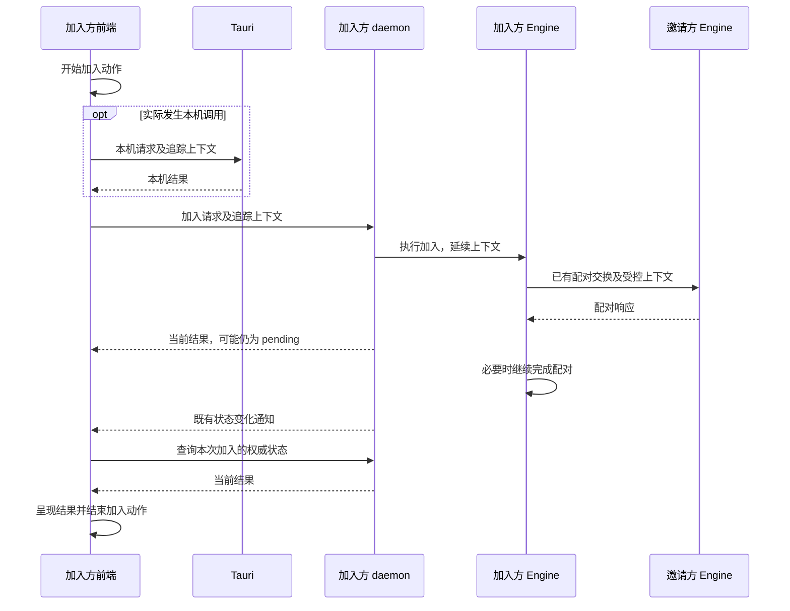

# 桌面配对全流程观测规格

- **状态**：待实施；本文不代表已完成接入或验收。
- **日期**：2026-09-06。
- **范围**：保留 Sentry，以“加入空间”为首个完整流程，贯通前端、实际参与的 Tauri 调用、daemon 与 Engine；开发时可用 Jaeger 查看。
- **前置工作**：前端厂商依赖已集中到公共诊断入口，详见[接入整理与迁移参考](../../.planning/research/sentry-posthog-migration/README.md)。
- **约束来源**：[产品原则](../../VISION.md)、[架构规则](../agent/architecture-rules.md)、[现有日志架构](../architecture/logging-architecture.md)。

## 1. 完成定义

以下条件必须同时满足：

1. 在真实桌面应用中点击“加入空间”，能够从一条记录中看到请求发出、后台接收、Engine 配对、结果查询及界面最终更新。
2. 能区分网络连接、对端处理、本机处理及结果显示等待；有嵌套关系的耗时不重复相加。
3. 关联日志可按同一个标准 Trace ID 查到；没有实际上下文的日志不伪造关联。
4. Sentry 的错误、日志、回放、反馈、设置门控和发布错误定位能力保持可用；本次不迁移 PostHog。
5. Jaeger 只在显式启用本地开发观测时接收数据，开关不改变远程诊断或产品分析许可。
6. 成功、拒绝、取消、失败、延后恢复、窗口关闭与进程重启均有明确的记录生命周期。
7. 完成 c/d 两实例真实配对验证，以及本规格规定的边界、安全和兼容性测试；测试样本与真实产品记录能够区分。

## 2. 当前事实与问题

当前 Desktop 固定的 Engine 提交为 `229edc7fdf23cacc45b5d3516f29d37e2326b719`。这是本次核对快照，不是本规格要求最终接入的版本。实施时必须固定通过验证的新版本，并同步 `uc-engine` 与 `uc-observability-contract`。

| 位置 | 已有能力 | 尚缺能力 |
| --- | --- | --- |
| `src/observability/diagnostics.ts` | 厂商无关的调用入口，当前使用 Sentry | 标准跨进程上下文及用户动作完整生命周期 |
| `src/observability/trace.ts` | 每次调用独立结束；重叠操作不猜测普通日志归属 | 异步请求、继续执行与结果呈现之间的明确关联 |
| `src/lib/ipc.ts`、Tauri commands | 传递编号与时间并写入日志 | 真正建立父子关系，而不只是同名日志字段 |
| daemon HTTP 中间件 | 独立请求编号、入口日志、响应耗时 | 接收前端上下文，并延续至 Engine |
| 新版 Engine 工作区 | 独立配对生命周期、受控追踪与日志输出 | 外部父关系、与桌面采集初始化组合、宿主服务资源配置 |
| Engine runtime / Collector | 有限字段和来源允许规则 | 接受经过批准的桌面节点与配对父关系 |
| 配对结果显示 | 通知触发重查，加入方每秒轮询兜底 | 结果已完成到界面呈现的可测量关联 |

Engine 现有配对记录显式创建独立根，输出规则还验证该根关系；仅设置父节点而不调整规则会导致记录被丢弃。Desktop 和新版 Engine 均有全局采集初始化，不能直接各安装一次。

## 3. 范围与非目标

### 本期必须覆盖

- 加入方从提交邀请码与口令，到显示加入结果；邀请方参与本次配对的实际处理。
- 请求快速返回 `pending` 后的后台处理，以及通知、重新查询、重连后的结果显示。
- Tauri 的标准传递边界，用一条现有本机调用验证；不为了凑链路把配对请求改道 Tauri。
- 原始 trace、对应日志及开发查看入口；本地采集失效时的产品行为。
- Sentry 兼容性和厂商边界；Engine 所需变更在 Engine 仓实现。

### 本期不做

- 不替换 Sentry，不安装 PostHog，不迁移历史云端数据和告警。
- 不推广到全部复制、搜索、文件传输流程；它们在首条流程验收后另行规划。
- 不改变配对协议的业务语义、成员确认规则、重试策略、超时设置或界面交互。
- 不部署公网 Jaeger、日志平台或自部署管理界面；保留标准输出边界即可。
- 不把 Jaeger 依赖图当作完整业务流程图，不为展示伪造服务或网络请求。
- 不将本期变成配对性能优化；先提供可核对的耗时证据。

## 4. 调用路径与归属

| 负责人 | 必须负责 | 不得负责 |
| --- | --- | --- |
| 前端流程 owner | 点击、当前动作句柄、等待、查询、呈现完成 | 根据日志或追踪结果推断配对成功 |
| 前端诊断入口 | 上下文生成/作用域、厂商映射、开发输出 | 成为配对状态的第二份来源 |
| Tauri / HTTP 边界 | 校验并接续上下文，记录实际请求 | 重新生成同一操作的独立追踪，或解析 Engine 内部步骤 |
| daemon 组合入口 | 每个进程的唯一采集初始化、输出、设置、退出 | 覆盖 Engine 的业务流程 owner |
| Engine Application | 已有加入生命周期、恢复及结算事实；持有不透明观测关联 | 依赖 Sentry、Jaeger 或 HTTP header 类型 |
| Engine 观测装配与网络适配 | 完整能力的耗时/结果记录、跨任务与对端传播 | 为观测新增业务步骤或把私有包暴露给 Desktop |
| Collector | 校验允许字段、发送到开发查看端 | 用放开全部字段的方法修复丢记录 |

## 5. 追踪上下文契约

### 5.1 一次执行与跨恢复关联

- 一个前端加入动作产生一个随机 W3C Trace ID；每个步骤有独立 Span ID。现有 UUID 日志编号不能直接冒充完整追踪上下文。
- 同一次未中断加入及其真实对端处理使用该 Trace ID，并保持真实父子关系；不以 route、整个窗口生命周期或 WebSocket 长连接作为加入动作根。
- Engine 已有不透明流程关联用于跨恢复查询；它不是 Trace ID，也不是用户、设备或产品分析身份。前端不得从邀请码、口令、DeviceId 或原始 joinId 派生远程关联号。
- 原始 joinId 可在本机内存中用于把业务操作与诊断句柄对应，但不得进入远程标签或传播字段。
- Engine 的诊断关联只能通过公开的观测合同传递；如需向宿主提供恢复关联，提供不透明句柄或诊断元数据，不扩展业务 DTO 来塞 SDK 对象，也不让 Desktop 读取私有存储。
- Trace/Span 上下文只在当前执行期延续，不把完整上下文写入恢复数据。重启后创建新 trace，使用 Engine 已批准的流程关联定位同一业务尝试。

### 5.2 HTTP 与 Tauri

- HTTP 使用 W3C `traceparent`；缺失或非法时正常处理业务请求并建立独立追踪，不返回业务错误，也不记录原始非法值。
- 本期不传递任意 `baggage`；`tracestate` 默认不转发。若 Sentry 适配确有必要字段，必须在组合入口显式允许，不能原样透传整个头。
- 只向本机已认证 daemon 或既有受信配对协议边界传播；不向更新服务、反馈服务等无关地址自动附带加入操作的上下文。
- daemon 扩展允许的跨域 header，但保持既有来源校验、认证和请求限制；追踪信息不能作为授权依据，也不能覆盖本机采样与远程发送许可。
- Tauri 使用结构化诊断元数据承载相同语义。生成声明和调用包装同步更新；新路径完成后删除旧编号字段的并行传递逻辑。
- 在异步任务、队列和回调边界显式捕获与恢复上下文；不得使用全局“当前操作”推断并发请求的归属。

### 5.3 结果查询与通知

- 前端保留本次动作句柄；由该动作触发的状态查询属于该动作，包括重连后的首次确认。
- 通知仍只是“重新查询”的信号，业务结论来自既有权威状态；不得以通知到达或 HTTP 200 作为成功证据。
- 对共享、合并或广播的刷新通知不强行指定单一父操作；没有明确归属就不附带该次操作上下文。各等待动作通过自身句柄发起查询。
- 同一窗口其他查询及其他窗口的动作不能继承本次加入上下文。重复通知、重复终态查询只能结束动作一次。

## 6. 记录生命周期与结果

| 情况 | 记录要求 | 业务要求 |
| --- | --- | --- |
| 提交加入 | 开始 `ui.join_space`，标记触发原因为用户操作 | 使用现有提交校验 |
| 返回 `pending` | 请求步骤结束；用户动作继续等待 | 不显示成功，不额外提交一次加入 |
| 加入成功 | Engine 根据权威结果结算；前端在成功状态提交到界面后结算 | 不把其他旧成员尚未确认说成全部完成 |
| 被拒绝或业务取消 | 固定结果 `rejected` / `cancelled`，正常结算 | 不统一报告成系统故障 |
| 业务超时/失败 | 使用既有错误分类，结果 `error` | 不新增只为观测服务的业务超时 |
| Engine 明确延后恢复 | 当前 Engine 执行段以 `deferred` 结束 | `pending` 本身不能被猜成 `deferred` |
| 同进程恢复 | 已结束的执行段不开回去；新的执行段保留流程关联；前端仍存活时可保持其用户动作父关系 | 使用既有恢复机制 |
| 页面卸载/窗口关闭 | 前端动作结束为 `detached`，只表示不再观察；后台工作按其真实生命周期继续 | 不擅自取消后台配对 |
| 正常进程退出 | 结算仍有 owner 的本地记录，限时 flush | 不等待遥测网络无限延迟退出 |
| 崩溃/强杀 | 允许原始记录不完整；恢复后新建 trace 并关联业务尝试 | 不伪造原进程的完成事件 |
| 重新打开窗口 | 创建新的状态确认动作；若有经批准的恢复关联则关联，否则保持无关联并说明缺口 | 不复用已经结束的原前端动作 |
| 关闭开发采集 | 结算或丢弃本地观测，不改变远程许可 | 业务继续执行 |

前端 `detached` 只属于 UI 观测结果，不能映射为 Engine 加入失败。采集结束不能反过来驱动业务状态变更。

## 7. 必须能解释的耗时

首期固定的用户动作名称为 `ui.join_space`；保留 Engine 既有 `pairing.lifecycle` 与配对子步骤名称。新增本机边界使用稳定的操作枚举或路由模板，不包含请求值。

至少能回答：

1. 点击到请求开始之间等待多久。
2. 请求传递、daemon 接收与启动 Engine 之间等待多久。
3. Engine 配对各已观测能力，以及真实邀请方处理分别耗时多久。
4. 配对完成后，等待下一次查询、查询结果、界面应用结果分别耗时多久。
5. 哪些日志、错误和等待属于该步骤，是否仍有不可解释的空档。

时长使用各进程的单调时钟；跨进程绝对时间只作对齐参考，跨设备需记录时钟误差边界。不用两台设备的墙钟相减宣称网络耗时，不把父步骤与其子步骤相加作为总耗时。

界面结束点定义为权威终态被对应可见界面提交后的首次确认，不是网络返回、调用 `setState` 或 toast 调用时刻；用 React 提交后的确认点实现，不逐帧采集。窗口不再观察按 `detached` 处理。

## 8. 服务、实例与输出

### 8.1 服务身份

| 运行部分 | 目标服务名称 | 区分方式 |
| --- | --- | --- |
| 前端与 Tauri GUI 宿主 | `uc-desktop` | 受控组件类型 `webview` / `gui-host`，各自运行实例 |
| daemon 内的 API 和 Engine | `uc-daemon` | API / Engine 的 instrumentation scope 与步骤名 |
| Engine 独立测试 | `uc-engine` | `test` 环境与测试实例 |

Engine 不是单独进程时，不为了图形人为拆成另一个服务。服务名称由宿主组合入口提供，Engine 独立使用保留默认名称。新增服务、scope 与结果值必须同步 runtime/Collector 的允许规则。

`service.instance.id` 使用运行期随机值，不使用真实业务 DeviceId。c/d 的调试说明通过本机实例对应关系完成；不得把可自定义 profile 名、主机名或用户名作为远程资源属性。开发真实操作为 `development`，自动测试为 `test`，发布运行保持现有发布环境分类。

### 8.2 保留 Sentry

- 应用调用方继续使用 `diagnostics.ts`；厂商 SDK、格式转换、采样适配留在私有接入处。后台由现有组合入口统一负责。
- Sentry 保留错误、日志、回放、反馈及发布映射；普通业务逻辑不新增 Sentry 或 PostHog 类型。
- 新增追踪采用标准上下文作为关联事实来源；Sentry 在边界承接或映射该上下文。不能再由 Sentry 和开发追踪各创建互不相关的同一次加入。
- 同一目的地不能重复创建相同业务步骤或重复报告同一异常。Sentry 保留原有页面等其他记录，不把所有已有自动采集一并重写。
- Sentry 原生关联或适配方式需要先做受控验证；不得把 Node.js 的集成方式直接当作 WebView 或 Rust 支持证明。无法保留现有能力时不得以“Jaeger 能看见”代替兼容性验收。

### 8.3 开发 Jaeger 与日志

- 开发启动配置只暴露是否启用本地追踪及本地 Collector 地址，不提供业务内的厂商选择器。
- 本期默认关闭；显式开启时允许明文 HTTP loopback，地址必须限制在 loopback。本期不新增发布版明文远程导出，也不内置远程 Collector 密钥。
- 本地受控配对诊断采用全采样，沿同次操作继承；Sentry 继续遵守独立的远程许可与采样。启用本地全采样不得强迫云端全量发送。
- 同一 Rust 进程仅注册一次全局采集；允许组合本机日志、Sentry 和开发输出层，不能并排安装两套全局 subscriber。
- 前端输出通道的网络许可只面向指定 loopback 接收端；若使用 Tauri 转交，仅作诊断传输，不改变配对业务请求路径。
- 本机日志保留现有按角色分文件、轮换与导出能力，并在存在有效上下文时加入标准 `trace_id`、`span_id`。错误与原始请求编号可共存，但名称不能混淆。
- Jaeger 查看 trace；日志仍通过现有本机查询/导出入口按 Trace ID 检索，本期不建设日志数据库。不得声称 Jaeger 已保存全部日志。
- 采集队列必须有界；服务不可达、队列满、导出超时只产生受控健康计数，不阻塞加入、界面或退出，不无限重试。复用已有容量/退出预算；任何新预算须在实现说明中给出数值和测试证据。

未来自部署沿标准导出接口扩展安全地址与认证，不需要更改业务记录；其部署和安全策略不属于本期。

## 9. 隐私、权限与兼容约束

1. `telemetryEnabled`、`usageAnalyticsEnabled` 与本地开发追踪是三个独立控制维度。产品事件继续走既有后台入口，不复制一条前端发送路径。
2. 远程诊断关闭后，不发送排队日志、已开始后才结束的记录、回放或 SDK 其他附加数据；不能只停止新建记录。
3. Trace ID、Span ID 与允许的恢复关联不得关联产品分析身份。任何新增持久化关联按项目默认加密规则处理；本期不以明文文件保存此类映射。
4. 请求头、请求体、响应体、邀请码、口令、令牌、正文、预览、搜索内容、文件名/路径、原始 IP 和真实设备身份不得进入新增观测输出。
5. 只增加固定名称、低基数字段、状态、耗时和必要的随机关联；不把原始错误字符串作为新字段。保留既有脱敏措施，不借接入扩大采集范围。
6. 父关系规则从“配对必须是独立根”扩展为“允许经验证的宿主父关系”；保持对名称、来源、字段和恢复关联范围的校验。现有合法 Engine 独立根仍受支持。
7. 默认不新增 span links；重启以既有不透明流程关联查询。若实现需要其他关系，先修订合同和对应过滤测试，不能暗中放开。
8. Engine 公共观测能力的修改在 Engine 仓实施、验证和发布，Desktop 只消费固定版本。禁止直接依赖 Engine 私有 Application/Infra 包或重建内部实现。

## 10. 实施切片与修改地图

以下为待实施工作，不是已完成清单。每片必须可独立验证，不能先拆掉仍工作的采集路径。

| 顺序 | 修改范围 | 通过门槛 |
| --- | --- | --- |
| A：采集组合 | Engine 公共观测装配；Desktop `crates/uc-bootstrap/src/observability/`；开发 Collector | 一个真实 daemon 同时保留本机日志和 Sentry，显式启用后可导出一个受控步骤；重复初始化、关闭、退出均验证 |
| B：请求关联 | `src/observability/`、两条本机调用包装、daemon client/HTTP 中间件、Tauri 元数据及生成声明 | 两个并发请求不串线；合法上下文接续；缺失/非法不影响业务；旧元数据路径完成删除 |
| C：加入闭环 | `useSetupFlow.ts`、`useJoinAdmission.ts`、邀请方确认流程；Engine 生命周期及过滤合同 | c/d 实际加入从点击到呈现可查询；请求返回 pending 后仍可跟踪；对端记录与日志可关联 |
| D：边界与交付 | 恢复、隐私、设置、跨平台测试与开发使用说明 | 下表验收完成，范围外能力明确保留，不把模拟通过当作真实设备通过 |

具体依赖版本、库选择、函数签名和队列参数在 A 片开始时依据现有依赖及维护中的官方库确定并记录；它们是实现选择，不能改变本规格的生命周期、隐私或验收要求。

## 11. 验收矩阵

| 编号 | 场景 | 必须观测到的结果 |
| --- | --- | --- |
| V01 | c/d 正常加入 | 一条加入动作的完整原始 trace；真实父关系；双方处理、终态呈现和对应日志 |
| V02 | 请求返回 pending | 请求结束但动作仍在等待；后台继续处理不丢关联 |
| V03 | 明确拒绝 | 显示既有拒绝结果；记录 rejected；不生成重复系统异常 |
| V04 | 取消、取消与成功竞争 | 使用业务实际最终结果；只结算一次，不因点击取消就伪造 cancelled |
| V05 | 连接失败/业务超时 | 可见错误与真实失败步骤；保留耗时；无永久伪运行记录 |
| V06 | 两个窗口或操作并发 | 各自编号与生命周期独立，日志不依赖全局当前操作猜测 |
| V07 | 通知重复/丢失、重连 | 通知继续触发权威查询；轮询兜底可见；结果不会重复结算 |
| V08 | 关闭窗口、后台仍配对 | 前端 detached；后台可完成；关闭窗口不取消业务 |
| V09 | daemon 重启恢复 | 新 trace 与旧执行段可按批准的流程关联定位；不复活旧父节点 |
| V10 | Collector 不可达/队列满 | 业务照常；无无限阻塞；丢弃或失败计数可见 |
| V11 | 本地追踪开、远程诊断关 | Jaeger 有记录；受控网络验证中 Sentry 无发送 |
| V12 | 运行中关闭远程诊断 | 已排队及后结算的数据不再外发；产品分析仍由自身开关控制 |
| V13 | 恶意/非法上下文 | 业务认证不变；无原始头泄漏；本机采样许可不被覆盖 |
| V14 | 合成敏感内容 | 在导出记录、关联日志与网络捕获中检索不到正文、凭据和真实业务身份 |
| V15 | Sentry 回归 | 错误、日志、反馈、回放开关、前端源码映射与既有原生符号流程有受控证据 |
| V16 | Tauri 真实本机调用 | 真实调用与前端动作关联；配对不被强行改道 |

验收材料必须记录版本、构建模式、环境、实例、采样状态、触发动作、预期结果、实际结果、Trace ID 和必要日志时间窗。材料使用合成业务内容，不包含密钥和真实用户数据。

先完成 macOS c/d 的最小闭环；跨平台交付还需 Windows WebView2 与 Linux WebKitGTK 的真实桌面证据。浏览器模拟、接口测试、Engine 独立测试和本机两实例验证分别列出，不互相替代。未执行的平台明确标为未验收，不标记本规格整体完成。

## 12. 标准与证据入口

- [W3C Trace Context](https://www.w3.org/TR/trace-context/)：标准上下文与信任边界；采用稳定版本，不自行定义另一套 HTTP 传播格式。
- [OpenTelemetry 上下文传播](https://opentelemetry.io/docs/concepts/context-propagation/)：跨边界延续及日志关联。
- [OpenTelemetry instrumentation scope](https://opentelemetry.io/docs/concepts/instrumentation-scope/)：区分宿主服务与内部模块。
- Engine 仓 `docs/design-docs/observability.md`：业务动作归属、隐私与可解释性规则；`tests/observability/collector/README.md`：当前开发入口。上游变更须同步其事实来源，本文不替代 Engine 的内部合同。
- Desktop 当前证据：`src/observability/diagnostics.ts`、`src/observability/trace.ts`、`src/hooks/useSetupFlow.ts`、`src/hooks/useJoinAdmission.ts`、`crates/uc-webserver/src/api/server.rs`、`crates/uc-bootstrap/src/observability/tracing.rs`。
